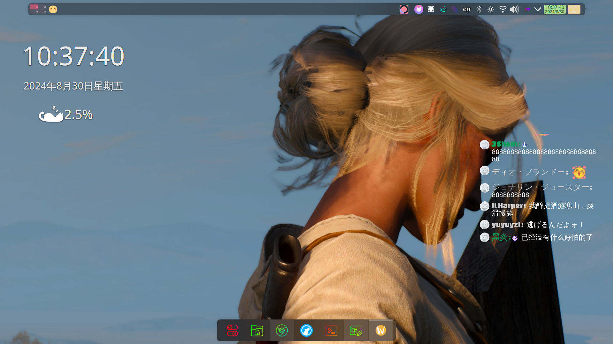
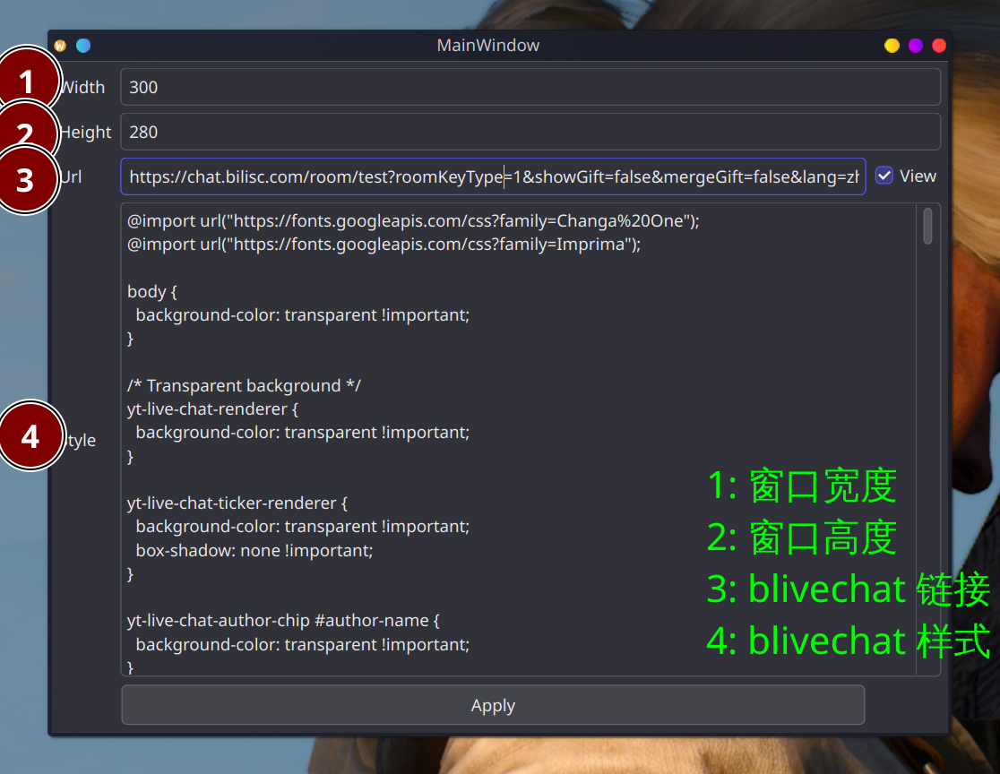
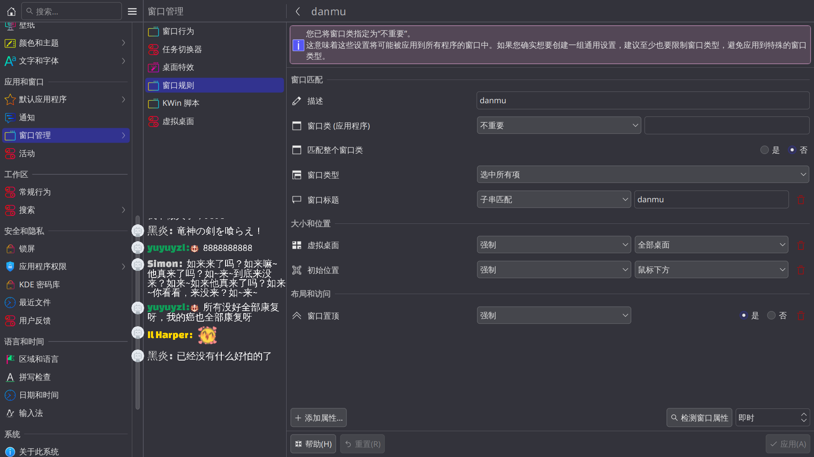

### qt-danmu



本项目依赖于[blivechat](https://github.com/xfgryujk/blivechat)项目.
通过该项目能够在Linux系统下显示弹幕信息.

#### 编译

需要QT5或QT6

```
git clone 
mkdir build
cd build
cmake ..
make
```

#### 使用

编译完后第一次使用会弹出设置窗口, 设置完成后即可正常显示弹幕信息.



[blivechat](https://github.com/xfgryujk/blivechat) 的设置查看该仓库页面或者前往 https://chat.bilisc.com/

在 https://chat.bilisc.com/ 的房间URL及样式生成器中的结果可以直接填入程序.
在以上示例中房间URL为测试URL.

在 Wayland + KDE Plasma 6 桌面环境下配合窗口规则设置更佳, 可以设置其启动时, 启动在鼠标所指位置以及置顶显示.
除此之外, 在窗口获得焦点后按下 `ALT + F3` 可以移动窗口位置等等.


